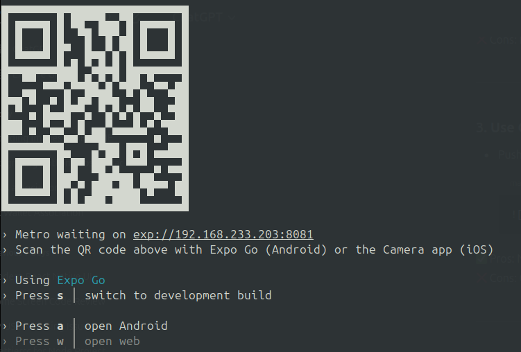
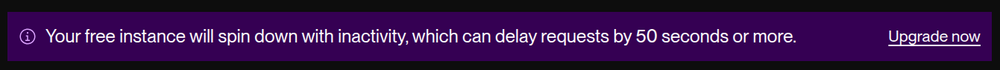
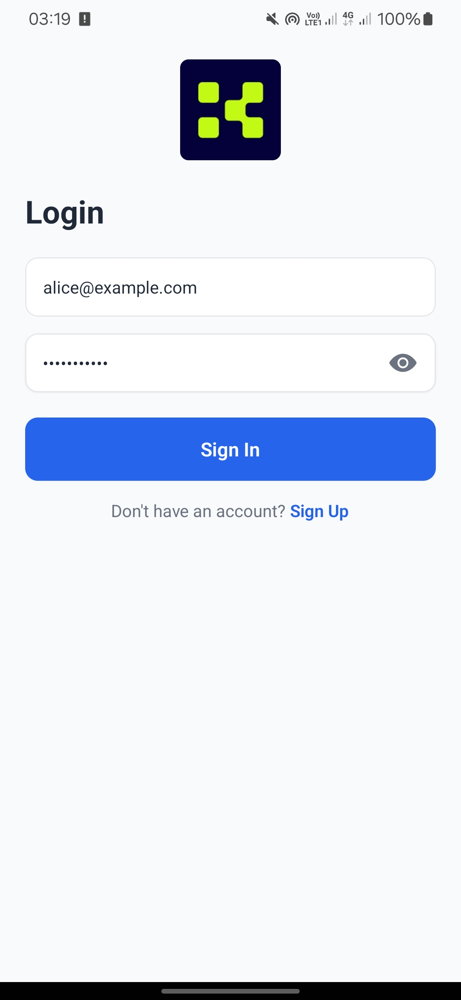
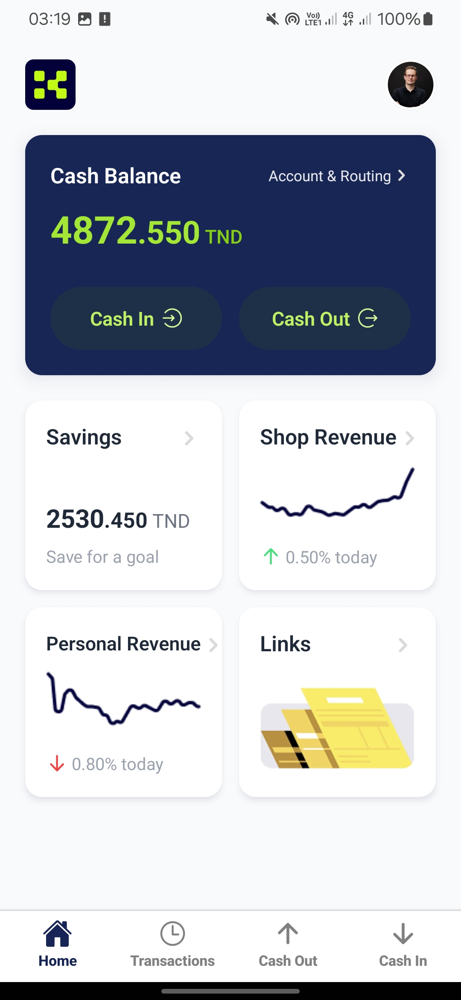
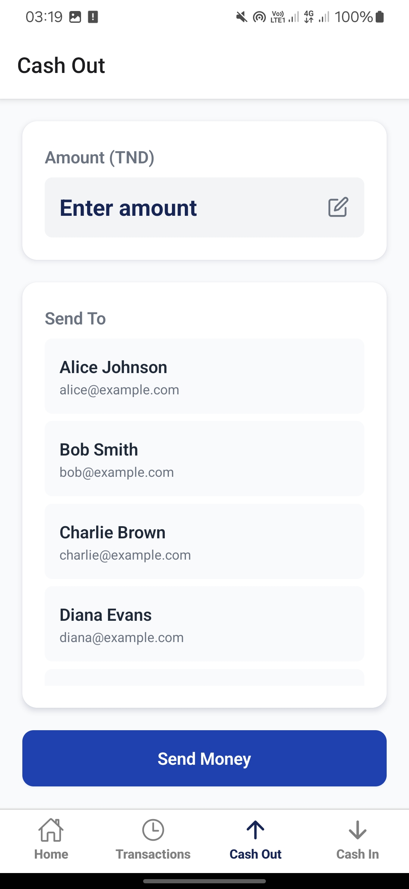
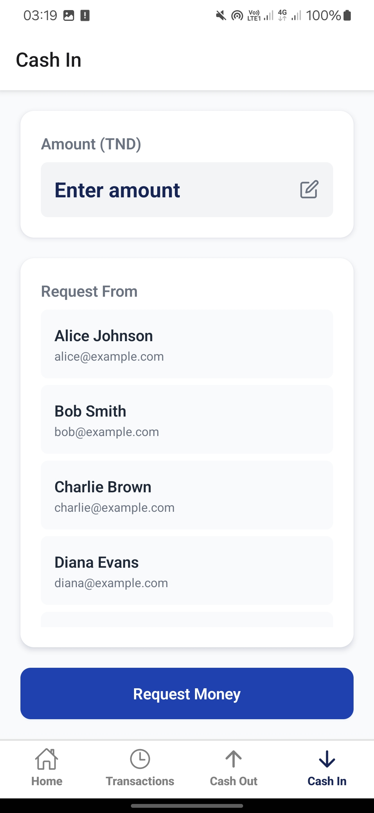
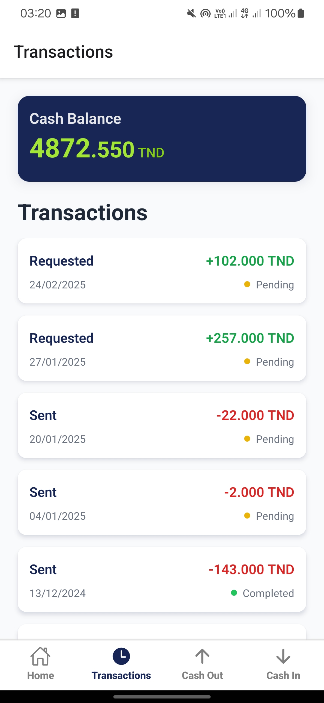
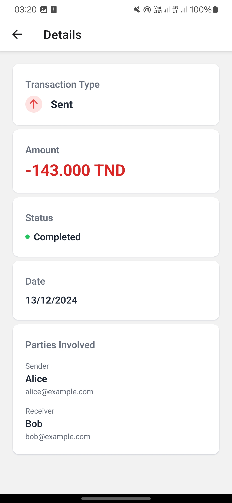
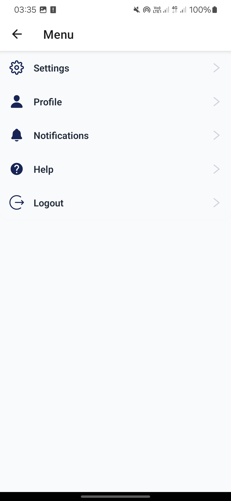

# React Native Coding Exercise

This app was created using Expo along with some additional libraries:

- **@react-native-async-storage/async-storage**: For persistent storage.
- **@react-navigation/native**: For navigation between screens.
- **nativewind**: For styling components using Tailwind CSS.
- **zustand**: For state management.

You can run this app using Expo Go without the need to create a build.

## Features

- **Login Screen**: Allows users to log in to their accounts.
- **Wallet/Home Screen**: Displays a list of user wallets.
- **Send Money Screen (Cash Out)**: Enables users to send money to others.
- **Request Money Screen (Cash In)**: Allows users to request money from others.
- **Transactions Screen**: Shows a list of all transactions.
- **Transaction Details Screen**: Provides detailed information about a specific transaction.
- **Logout Feature (From menu screen)**: Allows users to log out of their accounts from the menu screen.

## How to Run

Follow these steps to set up and run the project on your local machine:

1. **Clone the repository**:

   ```bash
   git clone https://github.com/RyoDagg/konnect.git
   ```

2. **Navigate to the project directory**:

   ```bash
   cd konnect
   ```

3. **Install dependencies**:

   ```bash
   npm install
   ```

4. **Run the project**:

   ```bash
   npm start
   ```

5. **Run with Expo Go**:
   - After running `npm start`, scan the QR code using the Expo Go app on your mobile device.
   - 

> Note: This app interacts directly with a simulated API/backend, fetching users and transactions from a database. Sending and requesting money updates wallet amounts and creates new transaction data. The API is hosted on a free instance on Render, which may cause delays of 50 seconds or more after periods of inactivity. Please be patient with the first request. 🚀
> 

## Screenshots

<table>
     <tr>
          <td></td>
          <td></td>   
          <td></td>
          <td></td>
     </tr>
     <tr>
          <td></td>
          <td></td>
          <td></td>
     </tr>
</table>
